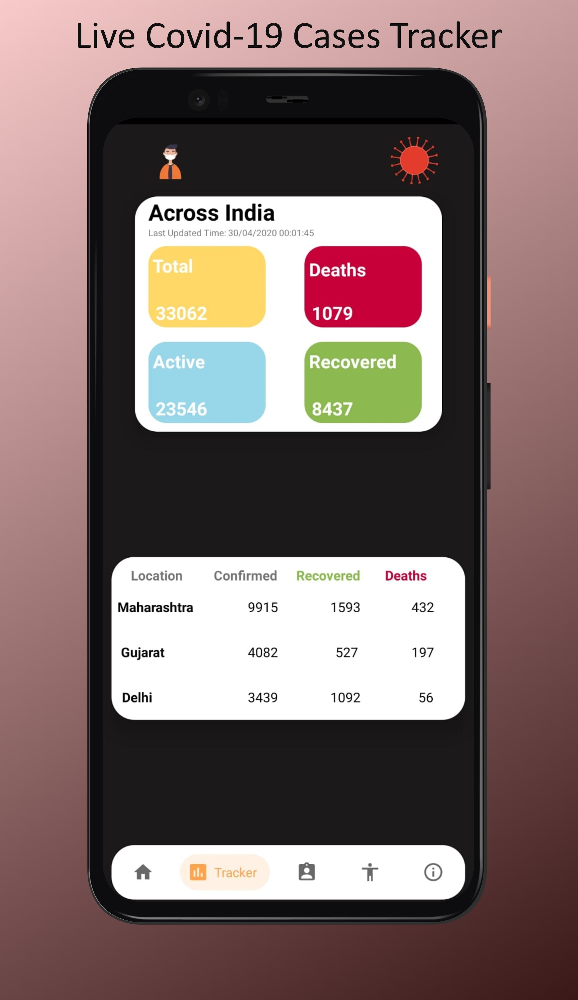
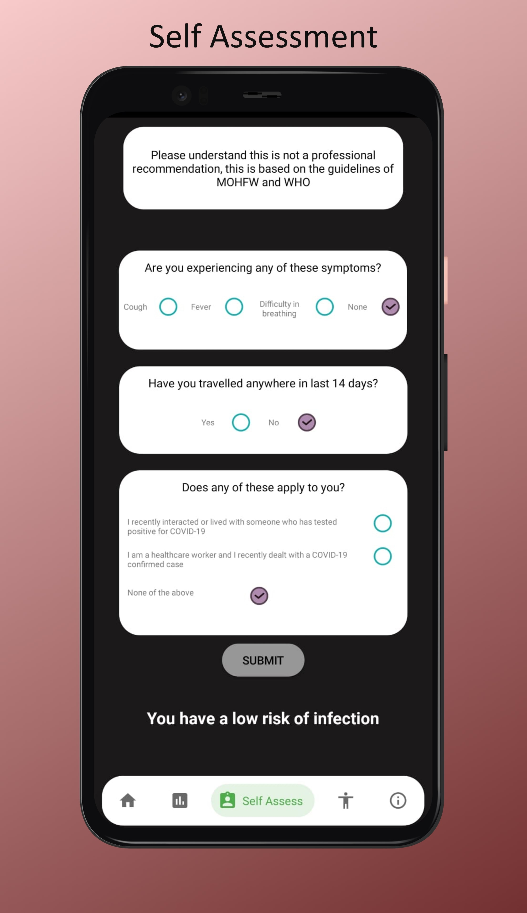
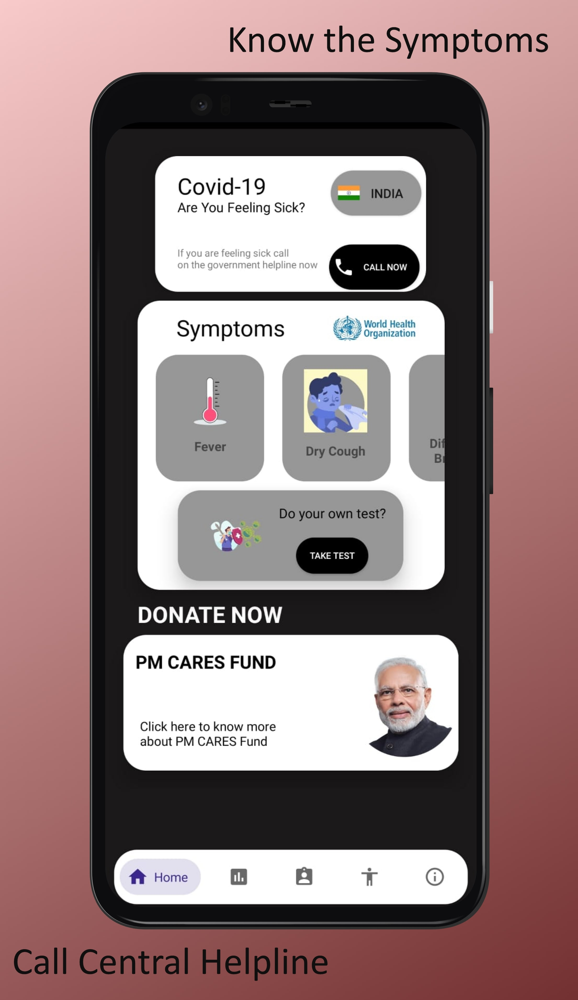
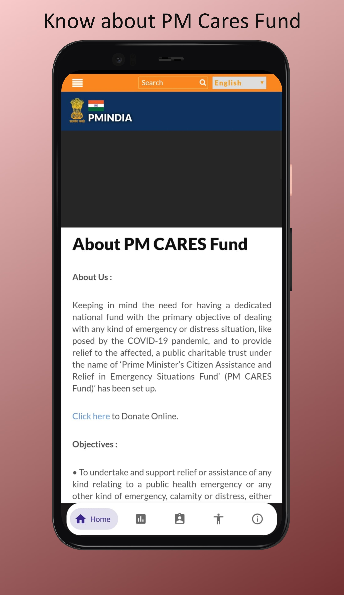
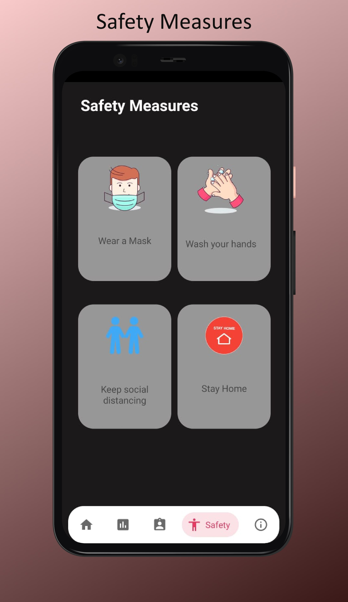

# NoCo-Covid19Tracker

NoCo - It is an Android app I built to spread awareness about COVID-19 and is dedicated it to all the frontline workers.

App has a good UI designed on Adobe XD and then implemented in XML.

App includes:
1) Covid-19 Live Cases Tracker(used an API to fetch data)

2) Self Assessment Test

3) Calling Helpline feature from the app 

4) About PM Cares Fund using Web View

5) Symptoms
6) Safety Measures

7) For Verification of User, phone verification is done via OTP

To download and try the application please visit this link:
https://drive.google.com/open?id=13f6iJoe7LyVHi8a-kEGum9OBJwENiA0g
